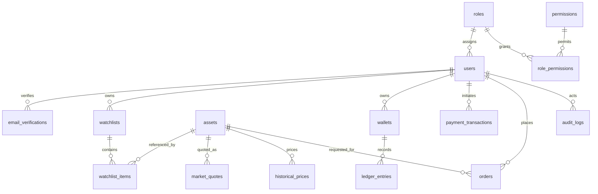

# Core database relationships

```mermaid
erDiagram
  roles ||--o{ users : assigns
  roles ||--o{ role_permissions : grants
  permissions ||--o{ role_permissions : permits
  users ||--o{ email_verifications : verifies
  users ||--o{ watchlists : owns
  watchlists ||--o{ watchlist_items : contains
  assets ||--o{ watchlist_items : referenced_by
  assets ||--o{ market_quotes : quoted_as
  assets ||--o{ historical_prices : prices
  users ||--o{ wallets : owns
  wallets ||--o{ ledger_entries : records
  users ||--o{ payment_transactions : initiates
  users ||--o{ orders : places
  assets ||--o{ orders : requested_for
  users ||--o{ audit_logs : acts
```

Financial movements are derived from ledger entries, not a browser-controlled balance.
